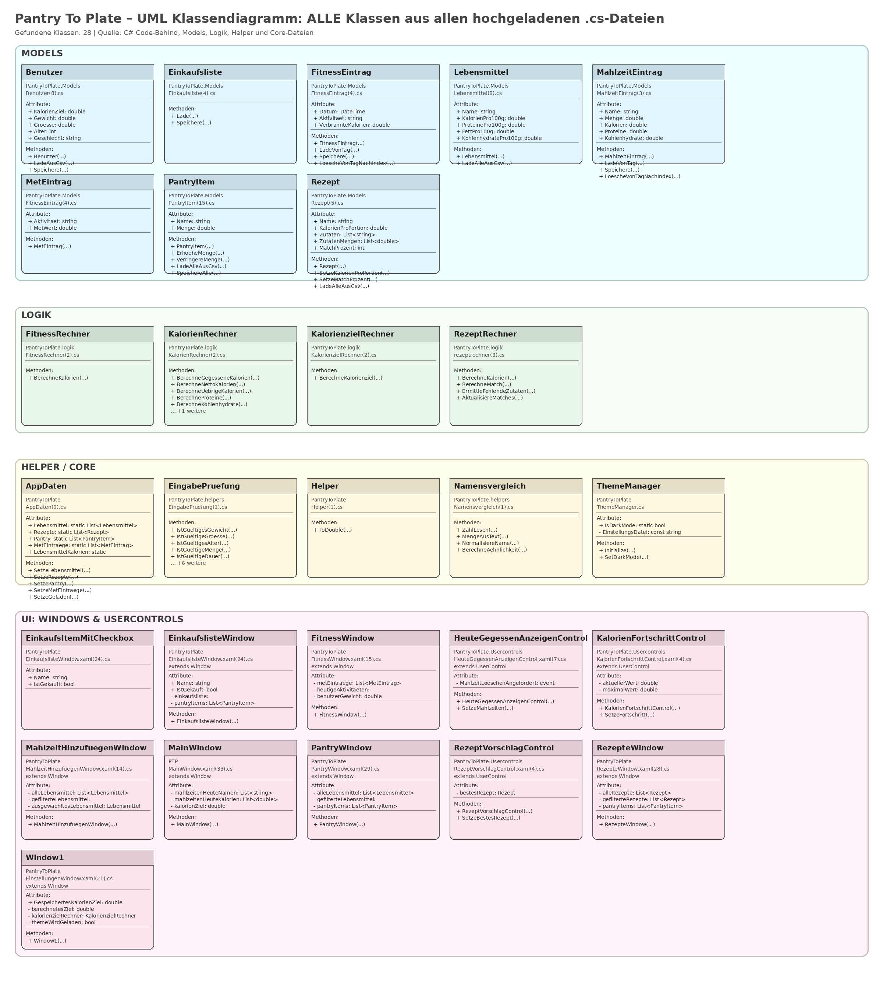
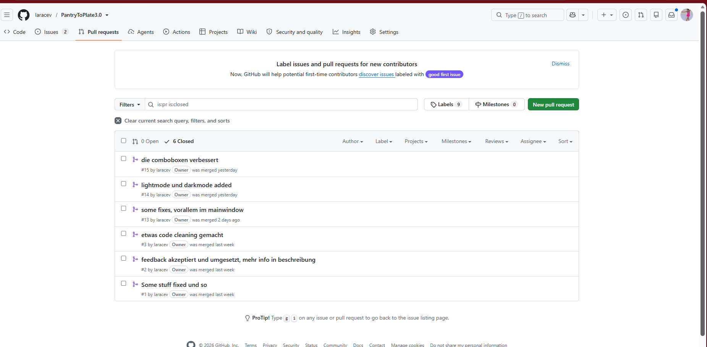
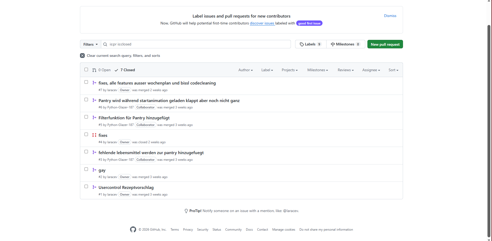
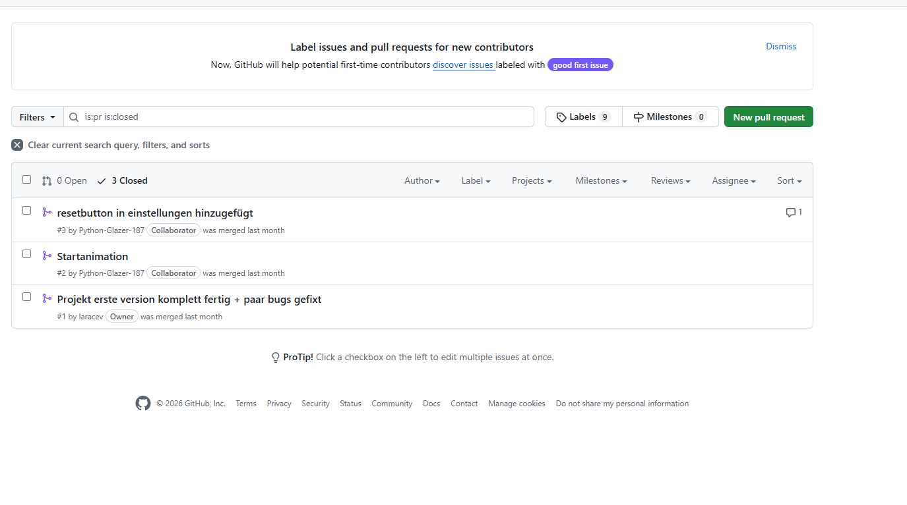

# Jahresabschlussprojekt

## Pantry To Plate  
### Healthy Eating App

**Dokumentation einer WPF-Anwendung für Rezeptsuche, Vorratsverwaltung, Einkaufsliste und Kalorienübersicht**

**Slogan:** Nicht verschwenden. Zutaten verwalten. Gesünder essen.

| Angabe | Information |
| --- | --- |
| Projektteam | Lara Cevik und Noel Ritter |
| Klasse/Kurs | 2AHIF / POS1 |
| Betreuung | David Bechtold |
| Projektname | Pantry To Plate |
| Projekttyp | WPF-Desktopanwendung |
| Repository | https://github.com/laracev/PantryToPlate3.0|
| Dokumentstand | Abgabefassung |
| Abgabedatum |23.06.2026 |


---

## Inhaltsverzeichnis

1. [Projektbeschreibung](#1-projektbeschreibung)
2. [Anforderungsanalyse](#2-anforderungsanalyse)
3. [Planungsphase](#3-planungsphase)
4. [Technische Voraussetzungen](#4-technische-voraussetzungen)
5. [Architektur und technische Umsetzung](#5-architektur-und-technische-umsetzung)
6. [Umsetzung und Funktionen](#6-umsetzung-und-funktionen)
7. [Bedienungsanleitung](#7-bedienungsanleitung)
8. [Qualitätssicherung und Tests](#8-qualitätssicherung-und-tests)
9. [Projektorganisation und GitHub](#9-projektorganisation-und-github)
10. [Abgabe und Projektstruktur](#10-abgabe-und-projektstruktur)
11. [Quellenverzeichnis](#11-quellenverzeichnis)
12. [Fazit und Ausblick](#12-fazit-und-ausblick)

---

## Abbildungsverzeichnis

| Nr. | Abbildung | Kapitel |
| --- | --- | --- |
| 1 | Logo / Startbild | Deckblatt |
| 2 | GUI-Skizze / Übersicht der Fenster | 3.2 |
| 3 | Klassendiagramm / UML | 3.4 |
| 4 | Startseite / Dashboard | 7.1 |
| 5 | Pantry-Fenster | 7.2 |
| 6 | Rezeptübersicht | 7.3 |
| 7 | Einkaufsliste | 7.4 |
| 8 | Mahlzeit hinzufügen | 7.5 |
| 9 | Einstellungen | 7.6 |
| 10 | Fitness-Fenster | 7.7 |
| 11 | GitHub Repository | 9.2 |
| 12 | Git-Commits / Branches | 9.3 |

---

# 1. Projektbeschreibung

## 1.1 Projektidee

Pantry To Plate ist eine Windows-Desktop-Anwendung, die Benutzerinnen und Benutzer bei der Mahlzeitenplanung, der Vorratsverwaltung und der täglichen Ernährungsübersicht unterstützt. Die Anwendung verbindet Pantry-Verwaltung, Rezeptvorschläge, Einkaufsliste, Mahlzeiten-Tracking und Fitnessaktivitäten in einem gemeinsamen System.

Die zentrale Idee ist, vorhandene Lebensmittel zuerst zu nutzen. Rezepte werden nach Übereinstimmung mit dem eigenen Vorrat sortiert. Fehlende Zutaten können direkt auf eine Einkaufsliste übernommen werden. Dadurch entsteht ein durchgängiger Ablauf: Vorrat prüfen, Rezept auswählen, fehlende Zutaten einkaufen, Rezept kochen und die Mahlzeit in der Tagesübersicht berücksichtigen.

## 1.2 Ausgangssituation

Im Alltag geht der Überblick über vorhandene Lebensmittel schnell verloren. Zutaten werden doppelt gekauft, verderben ungenutzt oder fehlen genau dann, wenn ein Rezept gekocht werden soll. Gleichzeitig ist die manuelle Dokumentation von Kalorien und Makronährstoffen zeitaufwendig.

Pantry To Plate bündelt diese Aufgaben in einer lokalen Anwendung. Die Daten werden ohne externe Datenbank in CSV-Dateien gespeichert. Dadurch bleiben die Daten einfach nachvollziehbar, lokal verfügbar und portabel.

## 1.3 Zielsetzung

Ziel des Projekts ist die Entwicklung einer benutzerfreundlichen WPF-Anwendung, die Lebensmittel, Rezepte, Vorräte und Tageswerte miteinander verbindet. Die Anwendung soll nicht nur einzelne Daten anzeigen, sondern mehrere praktische Funktionen zu einem sinnvollen Gesamtablauf kombinieren.

Die wichtigsten Ziele sind:

- Verwaltung vorhandener Lebensmittel in einer Pantry/Vorratsliste
- Anzeige und Filterung von Lebensmitteln aus einer CSV-Datenbasis
- Berechnung von Kalorien und Makronährstoffen
- Rezeptvorschläge anhand vorhandener Zutaten
- Übernahme fehlender Zutaten in eine Einkaufsliste
- Mahlzeiten- und Fitness-Tracking in einer Tagesübersicht
- Speicherung der Projektdaten in lokalen CSV-Dateien

## 1.4 Projektumfang

| Bereich | Umsetzung |
| --- | --- |
| Im Projekt enthalten | Lokale WPF-Anwendung, CSV-Datenhaltung, Pantry, Rezepte, Einkaufsliste, Mahlzeiten, Fitness, Einstellungen und Tagesübersicht |
| Nicht im Projekt enthalten | Externe Datenbank, API-Anbindung, mobile App, Benutzer-Login, Cloud-Synchronisation |
| Datenhaltung | Lokale CSV-Dateien im Projekt- bzw. Ausgabeordner |
| Zielplattform | Windows-Desktop |

---

# 2. Anforderungsanalyse

## 2.1 Must-have Features

| Nr. | Must-have Feature | Umsetzung im Projekt | Status |
| --- | --- | --- | --- |
| M-01 | Lebensmitteldatei als CSV | Lebensmitteldaten werden aus CSV-Dateien geladen | Erfüllt |
| M-02 | Filterung nach Lebensmittelart | Lebensmittel können gesucht und gefiltert werden | Erfüllt |
| M-03 | Pantry/Vorratsliste mit Mengenangabe | Lebensmittel können mit Mengenangaben gespeichert, aktualisiert und gelöscht werden | Erfüllt |
| M-04 | Kalorientracker mit Tagesziel | Startseite zeigt Ziel, gegessene, verbrannte und verbleibende Kalorien | Erfüllt |
| M-05 | Berechnung von Kalorien, Protein und Kohlenhydraten | Werte werden anteilig anhand der eingegebenen Menge berechnet | Erfüllt |
| M-06 | Gespeicherte Rezepte mit Zutaten und Zubereitung | Rezepte werden geladen, angezeigt und mit Zutaten geprüft | Erfüllt |
| M-07 | Rezeptvorschläge anhand vorhandener Lebensmittel | Rezepte werden nach Übereinstimmung mit der Pantry sortiert | Erfüllt |
| M-08 | Dashboard mit Kalorienübersicht und Rezeptvorschlägen | Dashboard fasst Tageswerte und Vorschläge zusammen | Erfüllt |

## 2.2 Nice-to-have Features

| Nr. | Nice-to-have Feature | Umsetzung im Projekt | Status |
| --- | --- | --- | --- |
| N-01 | Einkaufsliste aus fehlenden Zutaten | Fehlende Zutaten können auf die Einkaufsliste übernommen werden | Umgesetzt |
| N-02 | Anzeige fehlender Zutaten | Nicht vorhandene Rezeptzutaten werden angezeigt | Umgesetzt |
| N-03 | Fitness-Tracking | Aktivitäten und verbrannte Kalorien werden erfasst | Umgesetzt |
| N-04 | Wochenplan | Optionales Erweiterungsfeature, im finalen Projektumfang nicht vollständig umgesetzt | Offen / Ausblick |

## 2.3 Umsetzung der Mindestanforderungen aus POS1

| Anforderung | Konkrete Umsetzung im Projekt | Status |
| --- | --- | --- |
| OOP umgesetzt | Klassen wie `FoodItem`, `Recipe`, `PantryItem`, `Meal`, `UserProfile` und Rechnerklassen | Erfüllt |
| Collections verwendet | Listen für Lebensmittel, Rezepte, Pantry-Einträge, Mahlzeiten und Fitnessdaten | Erfüllt |
| UserControls implementiert | Wiederverwendbare UI-Elemente wie Karten und Anzeigen für Datenbereiche | Erfüllt |
| Grafische Darstellung von Objekten | Rezeptkarten, Lebensmittelkarten, Fortschrittsanzeigen und Makroübersicht | Erfüllt |
| Prozedurales Zeichnen von UI-Elementen | Diagramm- bzw. Balkendarstellungen für Kalorien und Nährwerte | Erfüllt |
| Serialisierung / Speichern und Laden | Speicherung und Laden über lokale CSV-Dateien | Erfüllt |
| Unterformulare / Pop-up-Fenster | Eigene Fenster für Mahlzeiten, Pantry, Rezepte, Einkaufsliste, Fitness und Einstellungen | Erfüllt |
| Logging implementiert | Aktionen und Fehler werden über Serilog in Log-Dateien protokolliert | Erfüllt |
| Animationen erstellt | Fortschrittsanzeigen, Warnungen und visuelle Übergänge in der Oberfläche | Erfüllt |

## 2.4 Abgrenzung

Die Anwendung wurde bewusst als lokale Desktopanwendung umgesetzt. Eine externe Datenbank, eine mobile Version oder eine Web-API waren nicht Teil des Projektumfangs. Der Fokus lag auf einer funktionierenden Anwendung mit nachvollziehbarer CSV-Datenhaltung, klarer Bedienung und der Umsetzung der geforderten OOP- und UI-Anforderungen.

---

# 3. Planungsphase

## 3.1 Team und Rollen

Das Projekt wurde von Lara Cevik und Noel Ritter gemeinsam umgesetzt. Die Aufgaben wurden nach Modulen und Arbeitspaketen aufgeteilt. Einzelne Funktionen wurden teilweise gemeinsam besprochen und anschließend getrennt umgesetzt.

| Person | Hauptaufgaben |
| --- | --- |
| Lara Cevik | Projektidee, Dokumentation, UI-Aufbau, MainWindow, Navigation, Einstellungen, Kalorienübersicht, GitHub-Pflege, Präsentation |
| Noel Ritter | Modelle, Klassenstruktur, Datenlogik, Berechnungen, Pantry-/Rezeptlogik, UI-Verbesserungen, Tests und Fehlerbehebung |
| Gemeinsam | Anforderungen, Tests, Fehleranalyse, Dokumentation, Abgabevorbereitung |

## Fensterübersicht

Vor der Umsetzung wurden die wichtigsten Fenster geplant. Ziel war eine einfache Navigation, bei der jede Hauptfunktion in einem eigenen Fenster bzw. Bereich dargestellt wird.


| Fenster | Zweck | Wichtige Funktionen |
| --- | --- | --- |
| `MainWindow` | Startseite und Tagesübersicht | Kalorienziel, Makros, Rezeptvorschläge, Navigation |
| `PantryWindow` | Vorratsverwaltung | Lebensmittel suchen, Menge speichern, Bestand löschen oder ändern |
| `RezepteWindow` | Rezeptübersicht | Rezepte anzeigen, filtern, Match berechnen, fehlende Zutaten anzeigen |
| `EinkaufslisteWindow` | Einkaufsliste | Fehlende Zutaten übernehmen, abhaken und in Pantry übertragen |
| `MahlzeitHinzufuegenWindow` | Mahlzeiten erfassen | Lebensmittel auswählen, Menge eingeben, Nährwerte berechnen |
| `EinstellungenWindow` | Benutzerdaten | Körperdaten speichern und Kalorienziel berechnen |
| `FitnessWindow` | Aktivitätserfassung | Aktivität, Dauer und verbrannte Kalorien speichern |

## 3.3 Benutzernavigation

Die Bedienung wurde so geplant, dass Benutzerinnen und Benutzer vom Dashboard aus alle Hauptbereiche erreichen. Der typische Ablauf besteht aus folgenden Schritten:

1. Persönliche Daten in den Einstellungen erfassen.
2. Lebensmittel in der Pantry eintragen.
3. Rezept mit hoher Übereinstimmung auswählen.
4. Fehlende Zutaten auf die Einkaufsliste übernehmen.
5. Nach dem Einkauf Zutaten in die Pantry übertragen.
6. Rezept kochen und als Mahlzeit speichern.
7. Tagesübersicht mit Kalorien und Makros kontrollieren.

## 3.4 Klassendiagramm / UML

Das Klassendiagramm zeigt die wichtigsten Datenmodelle, Rechnerklassen und Beziehungen der Anwendung. Besonders wichtig sind die Trennung zwischen Datenklassen, Berechnungsklassen und der Benutzeroberfläche.



Kurze Erklärung zum Klassendiagramm:

- Datenmodelle wie `FoodItem`, `Recipe`, `PantryItem`, `Meal` und `UserProfile` speichern die fachlichen Daten.
- Rechnerklassen wie `KalorienRechner`, `KalorienzielRechner`, `FitnessRechner` und `RezeptRechner` führen Berechnungen durch.
- Fensterklassen wie `MainWindow`, `PantryWindow` oder `RezepteWindow` stellen die Daten dar und reagieren auf Benutzereingaben.
- Hilfsklassen übernehmen CSV-Verarbeitung, Eingabeprüfung, Namensvergleich und Logging.

## 3.5 Grober Zeitplan

Der Zeitplan wurde an den tatsächlichen Projektverlauf angelehnt. Einzelne Arbeitspakete wurden teilweise parallel bearbeitet, weshalb die Zeitangaben als ungefähre Schätzung zu verstehen sind.

| Datum / Zeitraum | Tätigkeit | Verantwortlich | Geplante Zeit | Tatsächliche Zeit | Ergebnis |
| --- | --- | --- | --- | --- | --- |
| 12.05.2026 | Projektidee auswählen und grob beschreiben | Lara & Noel | 2 h | 2 h | Projektidee und Grundfunktionen definiert |
| 13.05.2026 | Must-have- und Nice-to-have-Features festlegen | Lara & Noel | 2 h | 2 h | Anforderungen dokumentiert |
| 14.05.2026 | GitHub-Repository anlegen und Projektstruktur vorbereiten | Lara | 1 h | 1,5 h | Repository und erste Ordnerstruktur erstellt |
| 15.05.2026 | MainWindow und erste Navigation umsetzen | Lara | 3 h | 4 h | Grundaufbau der Anwendung vorhanden |
| 15.05.2026 | Datenmodelle und Klassenstruktur erstellen | Noel | 3 h | 3 h | Erste Modelle und Klassen ergänzt |
| 16.05.2026 | CSV-Import, UTF-8-Probleme und Lebensmittelsuche bearbeiten | Lara & Noel | 4 h | 5 h | Datenimport stabilisiert |
| 17.05.2026 | UserControls, Karten und Kalorienfortschritt einbauen | Lara | 3 h | 4 h | Oberfläche besser strukturiert |
| 18.05.2026 | Einstellungen und Kalorienzielberechnung umsetzen | Lara | 3 h | 3,5 h | Personalisierung funktioniert |
| 19.05.2026 | Rezeptdaten, Rezeptsuche und Rezeptvorschläge umsetzen | Lara & Noel | 4 h | 5 h | Rezeptmodul funktionsfähig |
| 20.05.2026 | Darstellung und Layout verbessern | Noel | 2 h | 2 h | UI übersichtlicher |
| 21.05.2026 | Einheitliches Design und Navigation überarbeiten | Lara | 3 h | 3 h | Einheitlicheres Erscheinungsbild |
| 22.–26.05.2026 | Pantry, Einkaufsliste, Fitness und Fehlerbehandlung verbinden | Lara & Noel | 8 h | 10 h | Hauptmodule verbunden und stabilisiert |
| 27.05.2026 | Manuelle Tests und Dokumentation ergänzen | Lara | 4 h | 5 h | Testfälle und Dokumentation vorbereitet |
| 12.06.2026 | Bughunt und Bugfixes | Lara & Noel | 3 h | 4 h | Mehrere Fehler behoben |
| 15.06.2026 | Feedback einarbeiten | Lara | 2 h | 3 h | Rückmeldungen umgesetzt |
| 16.06.2026 | Code Cleaning und kleinere Verbesserungen | Lara | 2 h | 2 h | Code übersichtlicher |
| 20.06.2026 | Präsentation und finale Abgabe vorbereiten | Lara & Noel | 4 h | 4 h | Präsentation und Abgabe vorbereitet |

## 3.6 Planungsfazit

Die Planung war zu Beginn bewusst grob gehalten, da sich einzelne Anforderungen erst während der Umsetzung konkretisiert haben. Besonders die Verbindung zwischen Pantry, Rezepten, Einkaufsliste und Tagesübersicht benötigte mehrere Anpassungen. Durch regelmäßige Tests und kleinere Korrekturen konnte das Projekt schrittweise stabilisiert werden.

---

# 4. Technische Voraussetzungen

## 4.1 Entwicklungsumgebung

| Bereich | Verwendete Technologie |
| --- | --- |
| Programmiersprache | C# |
| Benutzeroberfläche | WPF / XAML |
| Framework | .NET Desktop / Windows Presentation Foundation |
| Zielplattform | Windows |
| Entwicklungsumgebung | Visual Studio mit Workload „.NET-Desktopentwicklung“ |
| Datenhaltung | Lokale CSV-Dateien im Ordner `data` bzw. im Ausgabeordner |
| Versionsverwaltung | Git und GitHub |
| NuGet-Pakete | Serilog, Serilog.Sinks.File, Serilog.Settings.Configuration |

## 4.2 Softwareversionen

Die exakten Versionen sollten für die finale Abgabe direkt aus Visual Studio bzw. aus der Projektdatei übernommen werden.

| Software / Komponente | Version |
| --- | --- |
| Windows | Windows 11 |
| Visual Studio | VS 2026|


## 4.3 Installation und Start

### Variante A – bereits kompilierte Anwendung

1. Veröffentlichungs-ZIP herunterladen oder Abgabeordner öffnen.
2. In den Ordner `bin` bzw. den veröffentlichten Ausgabeordner wechseln.
3. Die Datei `PantryToPlate.exe` starten.

### Variante B – Start aus Visual Studio

1. Repository klonen oder als ZIP-Datei herunterladen.
2. Projektmappe in Visual Studio öffnen.
3. Prüfen, ob die Workload „.NET-Desktopentwicklung“ installiert ist.
4. NuGet-Pakete wiederherstellen lassen.
5. Startprojekt auswählen.
6. Anwendung mit „Starten“ ausführen.

### Variante C – Start direkt aus dem Ausgabeordner

1. ZIP von GitHub oder aus der Abgabe entpacken.
2. In den Ordner `bin\Debug\...` oder `bin\Release\...` wechseln.
3. Die `.exe` starten.
4. Prüfen, ob die benötigten CSV-Dateien im richtigen Datenordner vorhanden sind.

---

# 5. Architektur und technische Umsetzung

## 5.1 Architekturüberblick

Die Anwendung ist in mehrere fachliche Bereiche aufgeteilt. Die Benutzeroberfläche wird mit WPF und XAML umgesetzt. Die zugehörigen Code-Behind-Dateien reagieren auf Benutzereingaben und rufen Datenmodelle, Hilfsklassen oder Rechnerklassen auf.

| Block | Aufgabe |
| --- | --- |
| Frontend / UI | Fenster, Buttons, Eingabefelder, Karten, Listen und Tabellen in XAML |
| Anwendungslogik | Berechnungen, Validierung, Suche, Sortierung und Rezeptvergleich |
| Datenmodelle | Repräsentation von Lebensmitteln, Rezepten, Pantry-Einträgen, Mahlzeiten, Fitnesswerten und Benutzerdaten |
| Datenhaltung | Lokale CSV-Dateien, keine externe Datenbank |
| Querschnittsfunktionen | Logging, Eingabeprüfung, Zahlenkonvertierung und Namensvergleich |

## 5.2 Datenhaltung mit CSV

Die Anwendung verwendet ausschließlich lokale CSV-Dateien zur Speicherung und zum Laden der Daten. Es wird keine externe Datenbank und keine JSON-Serialisierung verwendet.

| Datei / Datenbereich | Inhalt |
| --- | --- |
| Lebensmittel-CSV | Lebensmitteldaten und Nährwerte |
| Pantry-CSV | Vorratsliste mit Lebensmittelname und Menge |
| Rezept-CSV | Rezepte, Zutaten und Zubereitung |
| Mahlzeiten-CSV | Gegessene Mahlzeiten mit Datum und Nährwerten |
| Fitness-CSV | Aktivitäten, Dauer und verbrannte Kalorien |
| Einstellungen-CSV | Benutzerdaten und Kalorienziel |
| Log-Datei | Ereignisse, Fehler und technische Hinweise |

## 5.3 Datenfluss

Ein typischer Vorgang beginnt mit einer Eingabe in der WPF-Oberfläche. Die jeweilige Window-Klasse prüft die Eingabe und ruft anschließend eine Berechnungs- oder Hilfsklasse auf. Nach erfolgreicher Verarbeitung wird der neue Zustand in einer CSV-Datei gespeichert. Danach lädt das Fenster die aktuellen Daten erneut und aktualisiert Labels, Listen, DataGrids oder Fortschrittsanzeigen.

Beispiel: Rezept kochen

1. Benutzer wählt ein Rezept aus.
2. Anwendung prüft vorhandene Zutaten in der Pantry.
3. Fehlende Zutaten werden angezeigt oder auf die Einkaufsliste übernommen.
4. Beim Kochen werden vorhandene Mengen aus der Pantry abgezogen.
5. Die Mahlzeit wird mit Kalorien und Makronährstoffen gespeichert.
6. Die Tagesübersicht wird neu berechnet.

## 5.4 Wichtige Klassen und Module

| Datei / Modul | Aufgabe |
| --- | --- |
| `MainWindow.xaml` / `.cs` | Hauptfenster, Tagesübersicht und Navigation |
| `EinstellungenWindow` | Eingabe der Benutzerdaten und Berechnung des Kalorienziels |
| `MahlzeitHinzufuegenWindow` | Lebensmittelsuche, Mengenberechnung und Speicherung einer Mahlzeit |
| `PantryWindow` | Vorräte suchen, hinzufügen, speichern und löschen |
| `RezepteWindow` | Rezepte filtern, Match berechnen und Details anzeigen |
| `EinkaufslisteWindow` | Einkaufsliste darstellen, Einträge abhaken und hinzufügen |
| `FitnessWindow` | Fitnessaktivitäten erfassen und Kalorienverbrauch speichern |
| `KalorienRechner` | Tageskalorien und Makronährstoffe summieren |
| `KalorienzielRechner` | Persönliches Kalorienziel anhand Körperdaten und Aktivität berechnen |
| `FitnessRechner` | Verbrannte Kalorien mit MET-Werten berechnen |
| `RezeptRechner` | Kalorien, Übereinstimmung und fehlende Zutaten berechnen |
| `AppDaten` | Zentraler Zwischenspeicher für geladene Listen und Nachschlagetabellen |
| `Models` | Datenmodelle für Lebensmittel, Rezepte, Pantry, Mahlzeiten und Benutzer |
| `Helpers` | CSV-Import, Speicherung, Namensvergleich, Eingabeprüfung und Logging |

## 5.5 Verwendete Berechnungen

| Berechnung | Formel / Prinzip |
| --- | --- |
| Nährwerte einer Menge | Wert je 100 g × Gramm / 100 |
| Fitnesskalorien | MET-Wert × Körpergewicht in kg × Dauer in Stunden |
| Netto-Kalorien | Gegessene Kalorien − verbrannte Kalorien, mindestens 0 |
| Übrige Kalorien | Kalorienziel − Netto-Kalorien, mindestens 0 |
| Rezept-Match | Vollständig vorhandene Zutaten / Gesamtzahl Zutaten × 100 |
| Kalorienziel | Harris-Benedict-Grundumsatz × Aktivitätsfaktor ± Zielanpassung |

## 5.6 Bedien- und Fehlerkonzept

- Eingaben werden vor der Verarbeitung auf Zahlenformat und sinnvolle Wertebereiche geprüft.
- Bei fehlender Auswahl oder ungültiger Menge erhält der Benutzer eine verständliche Meldung.
- Dateizugriffe sind durch `try/catch` abgesichert.
- Fehler werden über `AppLogger` bzw. Serilog protokolliert.
- Listen werden nach Änderungen neu geladen, damit die Oberfläche den gespeicherten Zustand widerspiegelt.
- Ungültige Eingaben werden nicht gespeichert.

## 5.7 Logging

Für die Protokollierung wird Serilog verwendet. Logging ist besonders bei Dateioperationen, Importfehlern und unerwarteten Programmzuständen hilfreich. Dadurch können Fehler leichter nachvollzogen werden, ohne dass die Anwendung direkt abstürzt oder unklare Zustände entstehen.

Typische Log-Ereignisse:

- Starten der Anwendung
- Laden und Speichern von CSV-Dateien
- Fehler beim Parsen von Daten
- ungültige Benutzereingaben
- technische Fehler bei Dateioperationen

---

# 6. Umsetzung und Funktionen

## 6.1 Vorgehensweise

Die Umsetzung wurde in fachlich getrennte Module aufgeteilt. Zunächst entstanden Hauptfenster und Navigation. Danach wurden Eingabefenster, Datenmodelle und Berechnungsklassen ergänzt. Die Funktionalität wurde schrittweise erweitert und nach jedem größeren Arbeitsschritt manuell getestet.

Die Benutzeroberfläche ist in XAML definiert. Die zugehörigen Code-Behind-Dateien reagieren auf Eingaben und rufen Modelle oder Logikklassen auf. Wiederkehrende Berechnungen sind in separaten Klassen gekapselt.

## 6.2 Funktionsübersicht

| Funktion | Beschreibung |
| --- | --- |
| Tagesübersicht | Lädt Kalorienziel, Mahlzeiten und Fitnesswerte. Zeigt gegessene, verbrannte und verbleibende Kalorien sowie Proteine, Kohlenhydrate und Fett an. |
| Mahlzeit hinzufügen | Durchsucht die Lebensmitteldaten. Berechnet Kalorien und Nährwerte anteilig und speichert den Eintrag. |
| Pantry verwalten | Lebensmittel suchen, hinzufügen, aktualisieren und löschen. Die Suche sortiert Treffer nach Relevanz. |
| Rezepte anzeigen | Rezepte laden, filtern und anhand verfügbarer Zutaten sortieren. |
| Einkaufsliste | Fehlende Zutaten eines Rezepts übernehmen. Gekaufte Einträge abhaken und in den Vorrat übertragen. |
| Fitness | MET-Werte und Aktivitätsdauer werden mit Körpergewicht kombiniert. Verbrannte Kalorien fließen in die Tagesbilanz ein. |
| Einstellungen | Gewicht, Größe, Alter, Geschlecht, Aktivitätslevel und Ziel speichern. Daraus wird ein persönliches Kalorienziel berechnet. |

## 6.3 Umsetzung der Pantry

Die Pantry dient zur Verwaltung vorhandener Lebensmittel. Benutzerinnen und Benutzer können Lebensmittel suchen, eine Menge angeben und den Bestand speichern. Bereits vorhandene Lebensmittel können aktualisiert oder gelöscht werden.

Wichtige Eigenschaften:

- Suche nach Lebensmitteln
- Mengenangabe in Gramm
- Speicherung in CSV
- Aktualisierung der Anzeige nach Änderungen
- Grundlage für Rezeptvorschläge

## 6.4 Umsetzung der Rezepte

Rezepte werden aus den gespeicherten Rezeptdaten geladen. Die Anwendung vergleicht die benötigten Zutaten mit der aktuellen Pantry. Rezepte mit hoher Übereinstimmung werden bevorzugt angezeigt.

Wichtige Eigenschaften:

- Anzeige gespeicherter Rezepte
- Zutatenvergleich mit Pantry
- Berechnung einer Übereinstimmung in Prozent
- Anzeige fehlender Zutaten
- Übergabe fehlender Zutaten an die Einkaufsliste

## 6.5 Umsetzung der Mahlzeiten und Kalorienübersicht

Beim Hinzufügen einer Mahlzeit wird ein Lebensmittel ausgewählt und eine Menge eingegeben. Die Anwendung berechnet daraus Kalorien und Makronährstoffe anteilig. Die Werte werden gespeichert und auf der Startseite in der Tagesübersicht berücksichtigt.

## 6.6 Umsetzung der Einkaufsliste

Die Einkaufsliste übernimmt fehlende Zutaten aus Rezepten. Gekaufte Zutaten können abgehakt und anschließend in die Pantry übertragen werden. Dadurch ist der Ablauf zwischen Rezeptplanung und Vorratsverwaltung miteinander verbunden.

## 6.7 Umsetzung des Fitness-Trackings

Im Fitnessbereich können Aktivitäten mit Dauer gespeichert werden. Die verbrannten Kalorien werden anhand von MET-Werten, Körpergewicht und Aktivitätsdauer berechnet. Diese Werte werden in der Tagesübersicht von den gegessenen Kalorien abgezogen.

---

# 7. Bedienungsanleitung

## 7.1 Startseite / Dashboard

Nach dem Start zeigt das Hauptfenster das persönliche Kalorienziel, gegessene und verbrannte Kalorien, die verbleibenden Kalorien sowie Tageswerte für Proteine, Kohlenhydrate und Fett. Über die Navigation werden die einzelnen Funktionsfenster geöffnet.


## 7.2 Pantry verwalten

Im Pantry-Fenster können Lebensmittel gesucht und mit einer Menge in Gramm gespeichert werden. Bereits vorhandene Einträge können geändert oder gelöscht werden. Die gespeicherten Vorräte werden für Rezeptvorschläge verwendet.


## 7.3 Rezepte verwenden

Im Rezeptfenster werden gespeicherte Rezepte angezeigt. Die Anwendung prüft, welche Zutaten bereits in der Pantry vorhanden sind. Rezepte mit besserer Übereinstimmung werden höher angezeigt. Fehlende Zutaten können auf die Einkaufsliste übernommen werden.


## 7.4 Einkaufsliste verwenden

Die Einkaufsliste enthält Zutaten, die für ein Rezept fehlen. Einträge können abgehakt und anschließend in die Pantry übernommen werden. Dadurch werden eingekaufte Zutaten direkt in den Vorrat übertragen.


## 7.5 Mahlzeit hinzufügen

Im Fenster „Mahlzeit hinzufügen“ wird ein Lebensmittel gesucht und eine Menge eingegeben. Die Anwendung berechnet daraus Kalorien, Proteine, Kohlenhydrate und Fett. Nach dem Speichern erscheint die Mahlzeit in der Tagesübersicht.


## 7.6 Einstellungen

In den Einstellungen werden persönliche Werte wie Gewicht, Größe, Alter, Geschlecht, Aktivitätslevel und Ziel gespeichert. Daraus wird das persönliche Kalorienziel berechnet.

## 7.7 Fitness

Im Fitnessfenster können Aktivitäten und deren Dauer gespeichert werden. Die Anwendung berechnet die verbrannten Kalorien und zeigt sie in der Tagesübersicht an.

## 7.8 Typischer Arbeitsablauf

1. Persönliche Daten und Ziel in den Einstellungen festlegen.
2. Vorhandene Lebensmittel in der Pantry erfassen.
3. Ein Rezept mit hoher Übereinstimmung auswählen.
4. Fehlende Zutaten auf die Einkaufsliste setzen.
5. Gekaufte Zutaten abhaken und in die Pantry übernehmen.
6. Rezept kochen und als Mahlzeit speichern.
7. Fitnessaktivitäten ergänzen und Tagesübersicht kontrollieren.

## 7.9 Hinweise zur Bedienung

- Mengen werden in Gramm eingegeben.
- Dauerwerte werden in Minuten eingegeben.
- Bei ungültiger Eingabe erscheint ein Hinweis und die Aktion wird nicht gespeichert.
- Die Tagesübersicht berücksichtigt nur Einträge des aktuellen Datums.
- Die Anwendung erwartet die Datendateien relativ zum Projekt- bzw. Ausgabeordner.

---

# 8. Qualitätssicherung und Tests

## 8.1 Teststrategie

Die Anwendung wurde hauptsächlich mit manuellen Funktions- und Negativtests geprüft. Dabei wurden normale Abläufe, leere Eingaben, ungültige Zahlen, fehlende Auswahlwerte und typische Dateioperationen getestet. Für jeden Testfall wurden Vorbedingung, Aktion, erwartetes Ergebnis und Status festgehalten.

Die Tests wurden nach größeren Entwicklungsschritten durchgeführt, damit Fehler möglichst früh erkannt werden konnten. Besonders wichtig waren Tests zur CSV-Speicherung, zur Berechnung von Nährwerten und zur Reaktion auf ungültige Eingaben.

## 8.2 Testumgebung

| Bereich | Angabe |
| --- | --- |
| Betriebssystem | Windows 11 |
| Entwicklungsumgebung | Visual Studio, WPF-Projekt |
| Datenbasis | Lokale CSV-Dateien mit Lebensmitteln, Pantry, Rezepten, Mahlzeiten und Fitnessdaten |
| Testart | Manuelle Funktions- und Negativtests |
| Testpersonen | Lara Cevik und Noel Ritter |

## 8.3 Testfälle

| ID | Testziel | Durchführung | Erwartetes Ergebnis | Status |
| --- | --- | --- | --- | --- |
| T-01 | Mahlzeit hinzufügen | Lebensmittel auswählen, 150 g eingeben, speichern | Eintrag wird gespeichert; Kalorien und Makros steigen | Bestanden |
| T-02 | Ungültige Mahlzeitenmenge | Leere oder negative Grammzahl eingeben | Speicherung verhindert, Hinweis angezeigt | Bestanden |
| T-03 | Pantry verwalten | Lebensmittel hinzufügen, Menge erhöhen, Eintrag löschen | CSV und DataGrid zeigen korrekten Bestand | Bestanden |
| T-04 | Rezeptempfehlung | Pantry mit Rezeptzutaten füllen | Rezepte mit höherer Übereinstimmung oben | Bestanden |
| T-05 | Fehlende Zutaten | Rezept mit unvollständigem Vorrat öffnen | Fehlende Mengen werden angezeigt und können übernommen werden | Bestanden |
| T-06 | Rezept kochen | Rezept auswählen, Kochen bestätigen | Mengen aus Pantry werden abgezogen, Mahlzeit wird gespeichert | Bestanden |
| T-07 | Fitnessaktivität | Aktivität und Dauer speichern | Verbrannte Kalorien erscheinen in der Übersicht | Bestanden |
| T-08 | Einstellungen | Körperdaten, Aktivitätslevel und Ziel ändern | Kalorienziel wird neu berechnet und angezeigt | Bestanden |
| T-09 | Tageswechsel | Einträge eines früheren Datums vorhanden | Startseite zeigt nur Werte des aktuellen Tages | Bestanden |
| T-10 | Fehlende CSV-Datei | Eine benötigte Datei fehlt oder ist leer | Anwendung reagiert kontrolliert und protokolliert den Fehler | Bestanden |
| T-11 | Falsches Zahlenformat | Text statt Zahl eingeben | Eingabe wird abgelehnt und nicht gespeichert | Bestanden |

## 8.4 Gefundene Probleme und Lösungen

| Problem | Ursache | Lösung | Lerneffekt |
| --- | --- | --- | --- |
| Lebensmitteldaten bereitstellen | Ohne Datenbasis sind keine Nährwertberechnungen möglich | Import aus CSV-Dateien und Prüfung der Datenstruktur | Saubere Datenbasis ist Voraussetzung für verlässliche Ergebnisse |
| Tolerante Suche | Schreibweisen, Teilbegriffe und Umlaute erschweren exakte Treffer | Namen normalisieren und Treffer nach Relevanz sortieren | Gute Suchlogik verbessert die Bedienbarkeit deutlich |
| CSV-Zeichencodierung | Sonderzeichen und Umlaute wurden nicht immer korrekt dargestellt | UTF-8-Verarbeitung geprüft und angepasst | Einheitliche Codierung ist bei CSV-Dateien wichtig |
| Ungültige Eingaben | Benutzer können leere oder falsche Werte eingeben | Prüfung mit `TryParse`, Bereichsprüfungen und Hinweismeldungen | Eingabeprüfung verhindert Abstürze |
| GitHub-Struktur | Zu Beginn war die Repository-Struktur unübersichtlich | Repository bereinigt und Ordnerstruktur klarer angelegt | Erst Struktur festlegen, dann konsequent nutzen |

## 8.5 Testergebnis und Bewertung

Die Kernfunktionen funktionieren im dokumentierten Projektstand. Negativtests waren besonders wichtig, da ungültige Eingaben nicht zu einem Programmabbruch führen dürfen. Eingabeprüfungen, `TryParse`-Aufrufe, Bereichsprüfungen und Meldungen decken die wichtigsten Benutzerfehler ab.

Die Berechnungsklassen sind bereits relativ gut von der Oberfläche getrennt und eignen sich deshalb für automatisierte Unit-Tests. Für die Fensterlogik und die CSV-Persistenz fehlen derzeit systematische automatisierte Tests. Diese sollten bei einer Weiterentwicklung ergänzt werden.

---

# 9. Projektorganisation und GitHub

## 9.1 Projekttagebuch

| Datum | Aufgabe | Ergebnis / Notiz | Bearbeitung |
| --- | --- | --- | --- |
| 12.05.2026 | Projektidee, Anforderungen und erste Dokumentation | Grundfunktionen definiert | Lara & Noel |
| 14.05.2026 | Erstes GitHub-Repository angelegt | Versionsverwaltung vorbereitet | Lara |
| 15.05.2026 | MainWindow und erste Programmlogik | Grundaufbau der Anwendung | Lara |
| 15.05.2026 | Modelle und Klassen ergänzt | Datenstrukturen vervollständigt | Noel |
| 16.05.2026 | Aktuelles Repository, UTF-8-Fix, Suche begonnen | Datenimport stabilisiert | Lara & Noel |
| 17.05.2026 | Fenster, UserControls und Kalorienfortschritt | Navigation und Hauptanzeige funktionsfähig | Lara |
| 18.05.2026 | Einstellungen und Kalorienzielberechnung | Personalisierung umgesetzt | Lara |
| 19.05.2026 | Rezepte-CSV, Suche und Rezeptvorschläge | Rezeptmodul umgesetzt | Lara |
| 20.05.2026 | Darstellung der Werte verbessert | Übersichtlichkeit erhöht | Noel |
| 21.05.2026 | UI überarbeitet | Einheitlicheres Erscheinungsbild | Lara |
| 22.–26.05.2026 | Pantry, Einkaufsliste, Fitness und Fehlerbehandlung | Module verbunden und stabilisiert | Lara |
| 27.05.2026 | Manuelle Tests und Dokumentation | Abgabestand vorbereitet | Lara |
| 12.06.2026 | Bughunt & Bugfixes | Fehler gesucht und behoben | Lara & Noel |
| 15.06.2026 | Feedback akzeptiert und umgesetzt | Feedback eingearbeitet | Lara |
| 16.06.2026 | Code Cleaning | Kleinere Verbesserungen und Aufräumen | Lara |
| 20.06.2026 | Bugfixes und Präsentation | Präsentation und Abgabe vorbereitet | Lara & Noel |

## 9.2 Repository

| Angabe | Wert |
| --- | --- |
| Repository | https://github.com/laracev/PantryToPlate3.0 |
| Hauptbranch | main |
| Versionsverwaltung | Git |
| Dokumentation | README und Projektdokumentation |


## 9.3 Git-Arbeitsweise

Für die Versionsverwaltung wurde GitHub verwendet. Änderungen wurden regelmäßig committet und in das Repository hochgeladen. Dadurch konnten Arbeitsschritte nachvollzogen und Änderungen gesichert werden.

| Git-Aspekt | Umsetzung |
| --- | --- |
| Repository angelegt | Projekt wurde auf GitHub verwaltet |
| Commits | Änderungen wurden mit Commit-Nachrichten gespeichert |
| Push | Lokale Änderungen wurden regelmäßig auf GitHub hochgeladen |
| Branches | Für einzelne Features wurden Branches verwendet bzw. können im Repository nachvollzogen werden |
| Zusammenarbeit | Änderungen wurden zwischen den Teammitgliedern abgestimmt |

 - Version 3.0
 - Version 2.0
 - Version 1.0.

## 9.4 Wichtige Git-Befehle

| Befehl | Zweck |
| --- | --- |
| `git status` | Zeigt geänderte Dateien an |
| `git pull` | Holt Änderungen aus dem Remote-Repository |
| `git add .` | Fügt alle Änderungen zum nächsten Commit hinzu |
| `git commit -m "Beschreibung"` | Speichert Änderungen lokal mit Nachricht |
| `git push` | Lädt lokale Commits auf GitHub hoch |
| `git branch` | Zeigt vorhandene Branches an |
| `git checkout -b feature/name` | Erstellt einen neuen Feature-Branch |

## 9.5 Projektmanagement-Erkenntnisse

- Kleine, klar beschriebene Commits erleichtern die Zusammenarbeit.
- Gemeinsame Namenskonventionen reduzieren Integrationsfehler.
- Dokumentation sollte parallel zur Entwicklung aktualisiert werden.
- Tests nach jedem größeren Schritt verhindern schwer auffindbare Fehler am Ende.
- Eine klare Ordnerstruktur erleichtert die finale Abgabe.

---

# 10. Abgabe und Projektstruktur


## 10.1 Projektstruktur im Code

Die genaue Struktur kann je nach finalem Repository leicht abweichen. Grundsätzlich ist das Projekt in Oberflächen, Modelle, Hilfsklassen, Daten und Ausgabedateien aufgeteilt.

```text
PantryToPlate/
├── data/
│  
├── Models/
├── Helpers/
├── UserControls/
├── viewlol/ (die windows)
├── MainWindow.xaml
├── MainWindow.xaml.cs
├── App.xaml

```


# 11. Quellenverzeichnis

| Quelle | Verwendung | Adresse / Angabe | Lizenz / Hinweis |
| --- | --- | --- | --- |
Bundeslebensmittelschlüsse |Die Lebensmittel-csv|  https://www.blsdb.de/
| MET Compendium / MET-Tabellen | Orientierungswerte für Aktivitäten | Eigene Tabelle auf Basis von MET-Werten 
| Harris-Benedict-Formel | Schätzung des Grund- und Gesamtumsatzes | Formel aus Unterricht / Recherche
| Logo | Logo / visuelles Design | ChatGPT | KI-generiert, Nutzung in Projektdoku angeben |
| Emojis und Emoticons | Visuelles Design | https://emojidb.org/ 
| Screenshots der Anwendung | Bedienungsanleitung und Dokumentation | Eigene Screenshots | Eigenes Material |
| UML-/Klassendiagramm | Architekturübersicht | Eigenes Diagramm | Eigenes Material |
| GUI-Skizzen | Planungsunterlagen | Eigene Skizzen | Eigenes Material |

---

# 12. Fazit und Ausblick

## 12.1 Fazit

Das Projektziel wurde in den wesentlichen Punkten erreicht. Pantry To Plate kann Lebensmittel verwalten, Rezeptvorschläge anhand des Vorrats priorisieren, fehlende Zutaten in eine Einkaufsliste übernehmen und Mahlzeiten sowie Fitnessaktivitäten in einer Tagesübersicht zusammenführen.

Besonders wertvoll ist die Verbindung der einzelnen Module zu einem vollständigen Ablauf: Vorrat prüfen, Rezept auswählen, Einkauf planen, Rezept kochen und Tageswerte aktualisieren. Die lokale CSV-Datenhaltung war für den Projektumfang zweckmäßig und ermöglichte eine schnelle Umsetzung ohne zusätzliche Infrastruktur.

Das Projekt zeigt außerdem, dass eine wachsende Anwendung eine klare Trennung von Oberfläche, Logik und Datenhaltung benötigt. Die vorhandenen Datenmodelle und Rechnerklassen sind dafür ein guter Ausgangspunkt. Bei einer Weiterentwicklung sollten vor allem MVVM, automatisierte Tests und eine robustere Datenhaltung betrachtet werden.

## 12.2 Ausblick

Mögliche Erweiterungen für eine zukünftige Version:

- Umstellung auf MVVM für bessere Wartbarkeit und Testbarkeit
- SQLite-Datenbank statt mehrerer CSV-Dateien
- Benutzerkonten und mehrere Profile
- Wochen- und Monatsstatistiken mit Diagrammen
- Favoriten, Allergene und Ernährungsformen als Rezeptfilter
- Barcode-Scanner oder externe Lebensmitteldatenbank
- Automatisierte Unit-, Integrations- und UI-Tests
- Export von Einkaufsliste und Tagesübersicht
- Erweiterung um einen vollständigen Wochenplan

